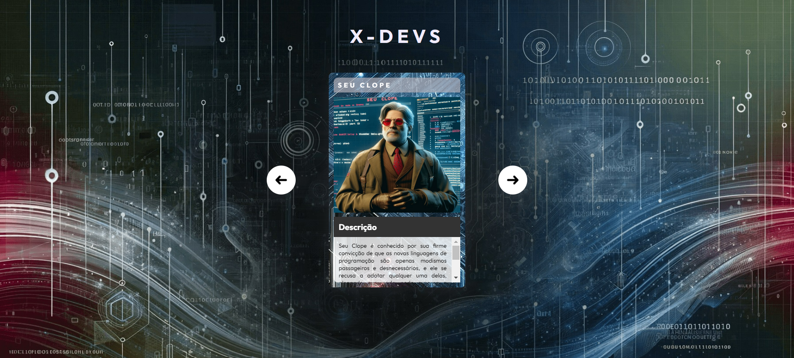

# Projeto X-Devs

Este é um projeto que combina HTML, CSS e JavaScript para criar uma página interativa que apresenta uma lista de personagens desenvolvedores fictícios inspirados nos X-Man.

## Como acessar o projeto

Você pode acessar o projeto [aqui](https://will-ribeiro00.github.io/Projeto-X-Devs/).

## Estrutura do projeto

O projeto consiste em três arquivos principais:

1. **index.html**: Este é o arquivo HTML que contém a estrutura da página, incluindo os elementos dos personagens e os botões para navegação entre eles.

2. **styles.css**: Este arquivo contém todas as regras de estilo CSS para o layout e a aparência visual da página.

3. **index.js**: Este é o arquivo JavaScript responsável pela interatividade da página, incluindo a funcionalidade dos botões de navegação entre os personagens.

## Como funciona

A página exibe uma lista de personagens, cada um com uma imagem, um nome e uma descrição. Os usuários podem navegar entre os personagens clicando nos botões de seta para a esquerda e para a direita.

  

## Tecnologias utilizadas

O projeto utiliza as seguintes tecnologias:

- HTML: para estruturação do conteúdo da página.
- CSS: para estilização e layout da página.
- JavaScript: para adicionar interatividade e funcionalidades dinâmicas à página.

## Contribuindo

Se você deseja contribuir para este projeto, sinta-se à vontade para fazer um fork deste repositório e enviar suas sugestões por meio de pull requests.

